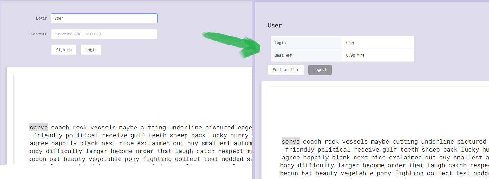
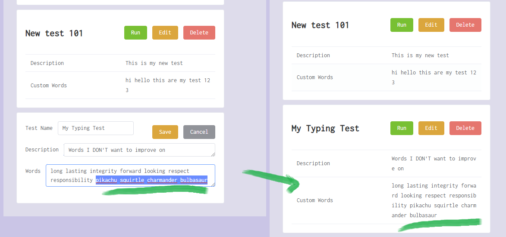
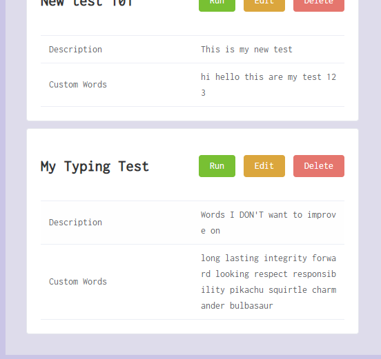
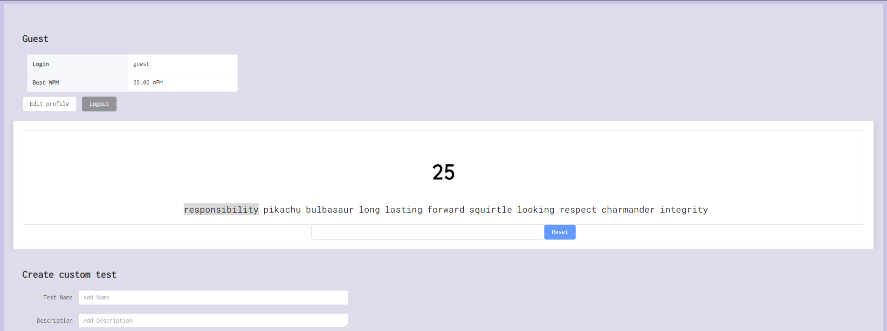

# Typing Test

Link to site: http://student-4.sutdacademytools.net (Hopefully its up)

### Link to backend repository: https://github.com/austin-jrh/sutd-devtools2022-backend

---

### Table of Contents 
- [Features](#features)

## Features

Typing Test is a simple typing test app where you can measure your typing speed.

Features are:
- User Profile
  - Register, Login, Edit Display Name, Persistent User using `localStorage`.
- Typing Test
  - Generate Random words, Custom user defined words, (scuffed) WPM calculation, saving of high score to logged in user.

## Technical Stack
### Front-end
Using:
- Vue.js (MVVM framework)
- Element+ (UI framework)
- random-words (NPM library)
- Google Fonts (Roboto Mono and Inconsolata)

### Back-end - [link to repository](https://github.com/austin-jrh/sutd-devtools2022-backend)
Using:
- Node.js (runtime environment)
- Express (web application framework)
- Sqlite (database)

## Demo
- Login to existing user




- Edit display name of logged in user


- Custom tests


- Create Custom Test


- Edit existing Custom test




- Run Custom test





- Delete existing Custom test


## Setup
1. Clone the repository. 
```
git clone https://github.com/austin-jrh/sutd-devtools2022.git
```

2. Navigate to path where the `Dockerfile` exist.
```
cd devtools2022-frontend/
ls # you should be in the Dockerfile directory
```

3. Run `run.sh` to build and run Dockerfile.
```
./run.sh
```

4. Check if the Docker container is running.
```
docker ps
```

## Security Vulnerability
### SQL Injection attack with crafted form inputs (login)
### Modifying the database without authorization (change highscore)
### Access to profiles
